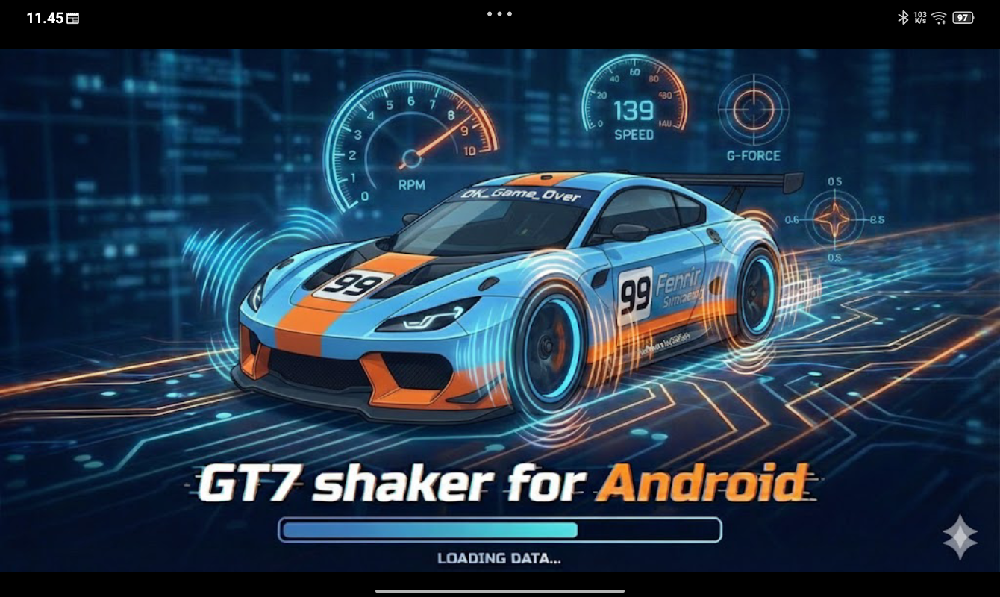
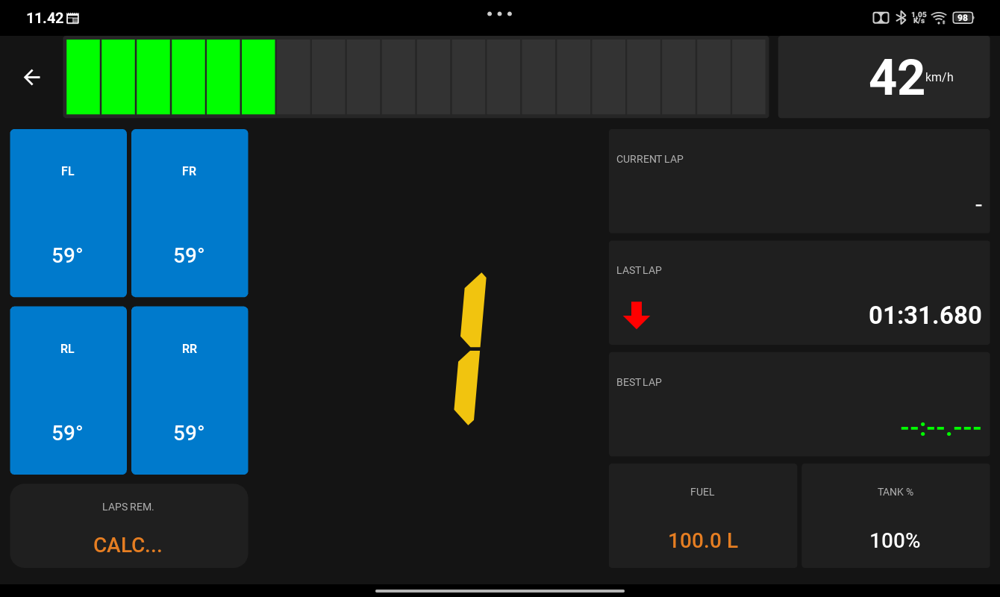
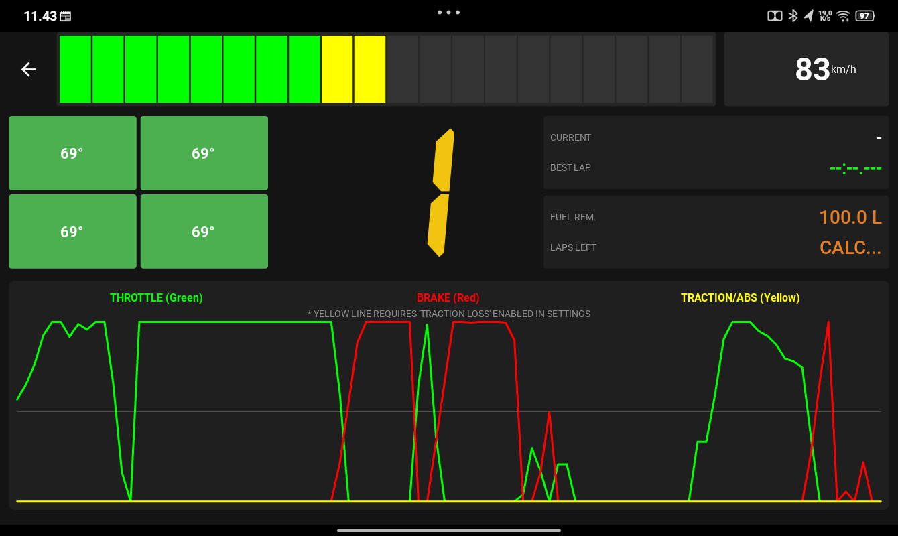
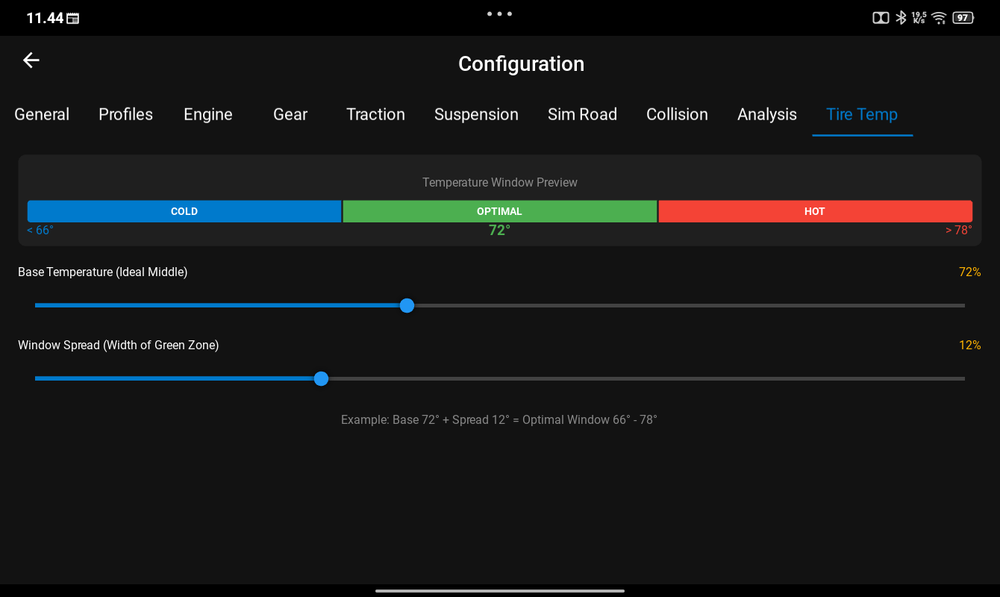
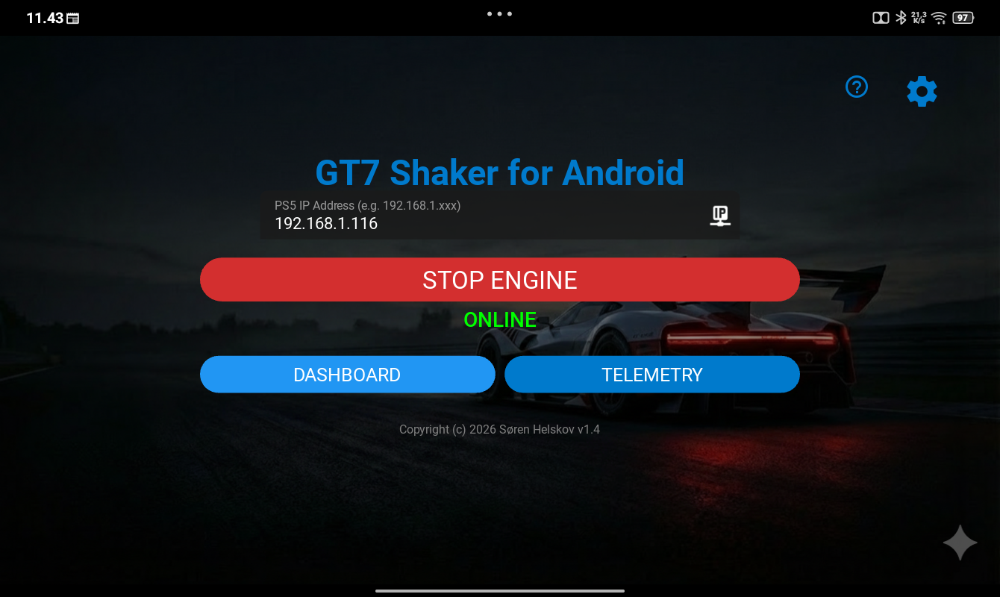
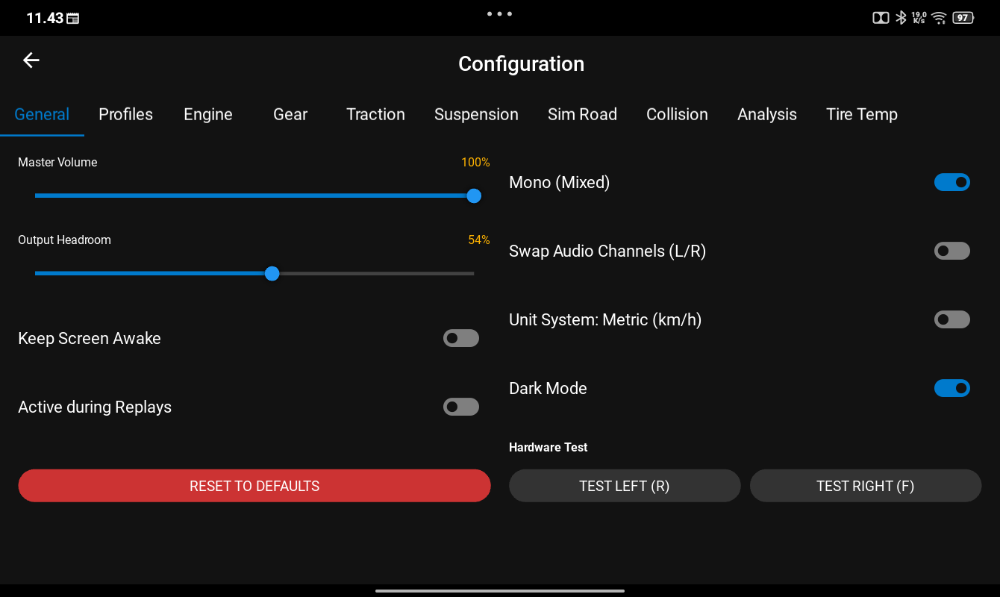
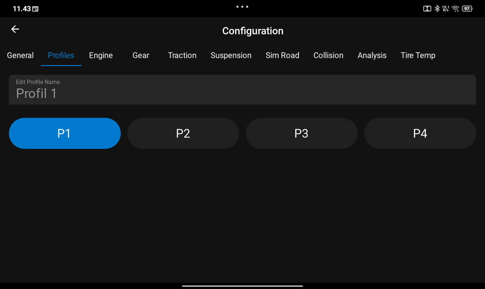
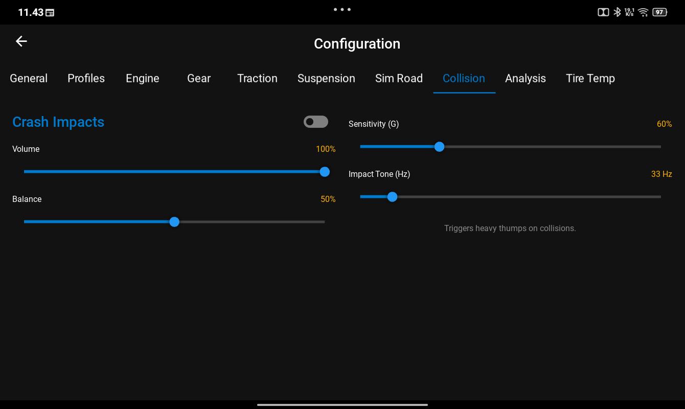

# 🏎️ GT7 Shaker - Realtime Telemetry Dashboard

**Transform your Android device into a professional racing dashboard for Gran Turismo 7.**

## 📋 Overview
GT7 Shaker is a lightweight, zero-latency telemetry dashboard designed for Sim Racers. It connects directly to your PlayStation 4 or 5 via UDP to display critical race data that isn't always visible on the main screen.

**🚀 Evolution:** This Android application is a direct evolution and mobile port of my open-source project, **[GT7 Shaker for Linux](https://github.com/Helskov/GT7-Shaker-for-linux)**. It brings the same precision and speed to your phone or tablet.

## ✨ Key Features

* **🛞 Live Tire Temperatures:** Visual heat-map for all 4 tires (Cold/Optimal/Hot) to help you manage grip.
* **⏱️ Advanced Lap Timing:** Integrated lap counter and pace indicators.
* **🔧 Deep Customization:** Fine-tune collision sensitivity and shaker intensity.
* **⚡ Zero Lag:** Uses native UDP packets for instant feedback.

---

## 📸 Screenshots

### Race Dashboards
| Standard Dash | Telemetry Focus |
|:---:|:---:|
|  |  |

### Vehicle & Tire Data
| Tire Temperatures | Initial Connection |
|:---:|:---:|
|  |  |

### Configuration & Settings
| General Settings | Car Profiles | Collision/Shaker |
|:---:|:---:|:---:|
|  |  |  |

---

## 📥 Installation (Android)

Since this app is built by a solo developer and not hosted on the Google Play Store, your phone will treat it as an "Unknown Source." This is normal.

1.  **Download:** Go to the **[Releases](../../releases)** page and download the latest `.apk` file (e.g., `app-1.4-arm64-v8a-release.apk`).
2.  **Install:** Open the file on your phone.
3.  **Security Warning:** You will likely see a popup saying **"Blocked by Play Protect"**.
* Click **"More Details"** (or the arrow down).
* Select **"Install Anyway"**.

---

## ⚙️ Setup Guide

### 1. Configure Gran Turismo 7 (PS4/PS5)
1.  Go to **GT Menu** -> **Options** -> **Network**.
2.  Enable **Telemetry Settings** (Broadcast Mode).
3.  Set the destination IP to your phone's IP address.

### 2. Connect the App
1.  Ensure your Phone and PlayStation are on the **same Wi-Fi network**.
2.  Enter your PlayStation's IP Address in the app settings.
3.  **Pro Tip:** For the best stability, use a **5GHz Wi-Fi** connection and avoid using Bluetooth peripherals simultaneously unless they support **Bluetooth 5.2+ Low Latency**.

---

## 📜 License & Credits
* This project is based on the original work found at [GT7-Shaker-for-linux](https://github.com/Helskov/GT7-Shaker-for-linux).
* This project is not affiliated with Polyphony Digital or Sony Interactive Entertainment.
* Created by Helskov.
